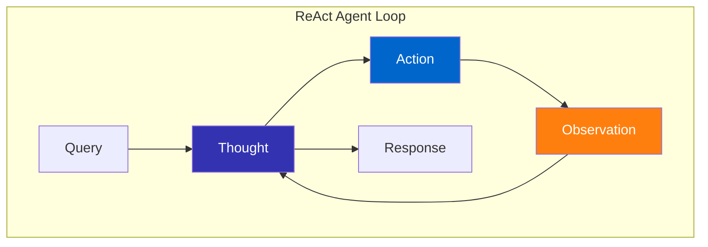
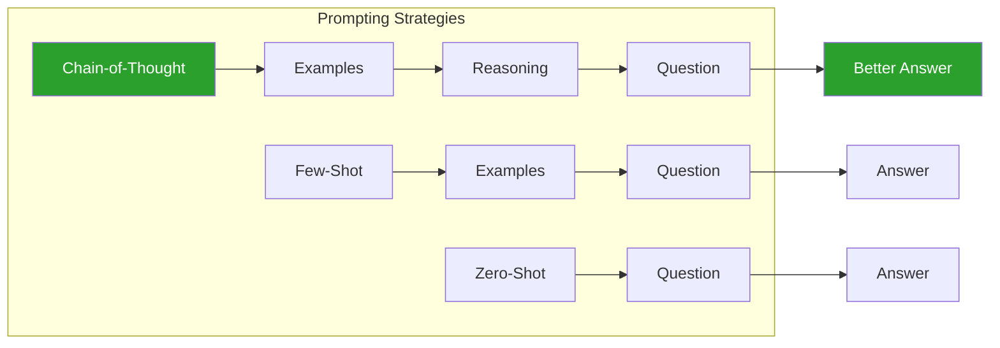
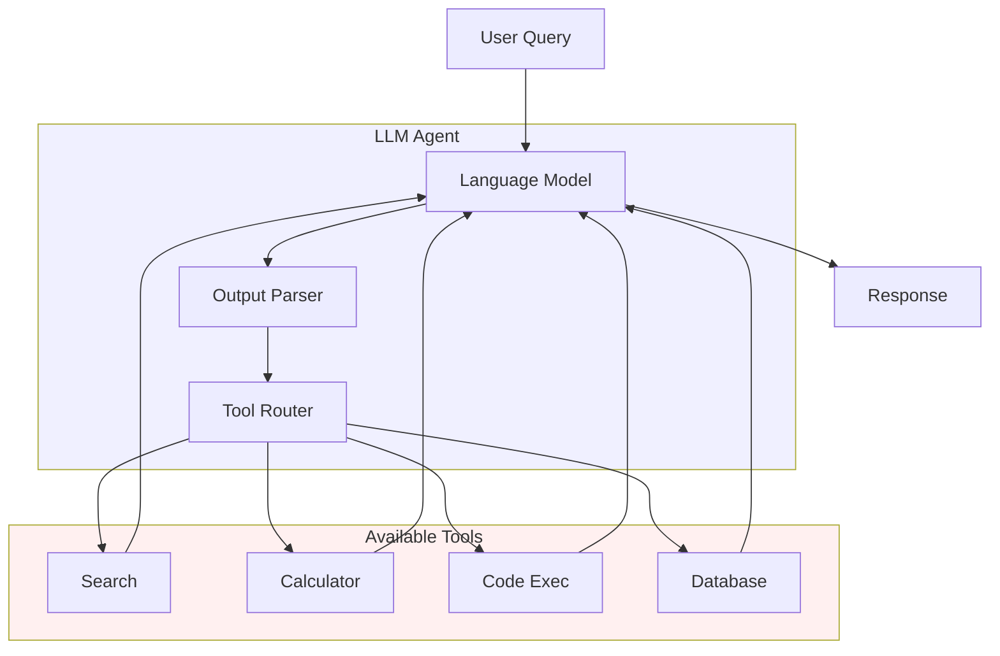
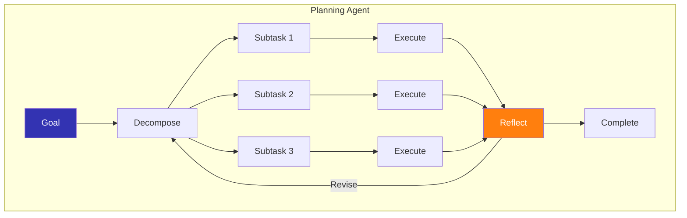
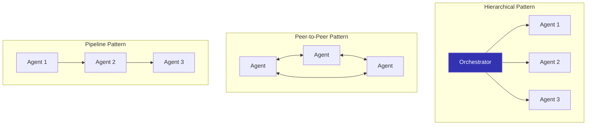
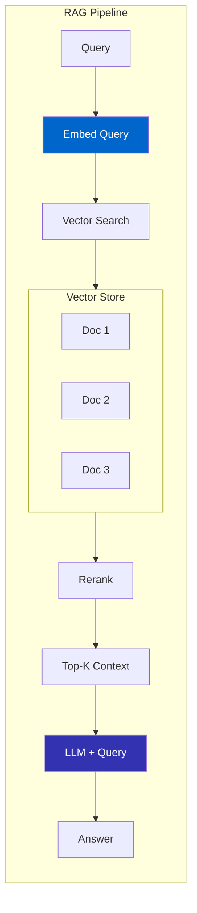
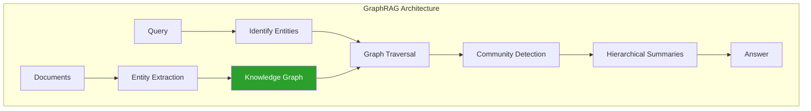
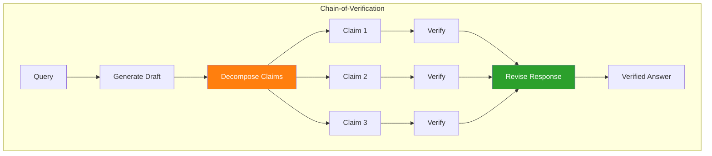
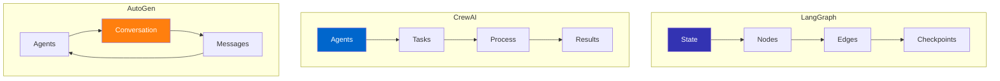

# Agent Architectures

Interactive diagrams illustrating key agent architectures covered in the course.

## Week 1: ReAct Loop

The fundamental reasoning-acting cycle.



**Key Components:**
- **Thought**: Internal reasoning about the task
- **Action**: Tool call or external interaction
- **Observation**: Result from the action
- **Loop**: Continue until task is complete

---

## Week 2: Prompting Strategies

Comparison of prompting approaches.



---

## Week 3: Tool Use Architecture

How agents integrate with external tools.



---

## Week 4: Planning Architecture

Hierarchical task decomposition.



---

## Week 5: Multi-Agent Orchestration

Patterns for agent coordination.



---

## Week 7: RAG Pipeline

Retrieval-Augmented Generation flow.



---

## Week 8: GraphRAG

Knowledge graph enhanced retrieval.



---

## Week 9: Chain-of-Verification

Hallucination prevention through verification.



---

## Framework Comparison



---

## Using These Diagrams

### In Your Slides

Reference these diagrams in presentations by linking to this page or recreating in LaTeX with TikZ.

### In Notebooks

Use Mermaid in Jupyter with:

```python
from IPython.display import display, HTML

mermaid_code = """
graph LR
    A --> B
"""

display(HTML(f'<pre class="mermaid">{mermaid_code}</pre>'))
```

### Customization

Edit diagrams by modifying the Mermaid code. See [Mermaid documentation](https://mermaid.js.org/syntax/flowchart.html) for syntax.

---

*Diagrams are interactive - hover for details, click to zoom where supported.*
