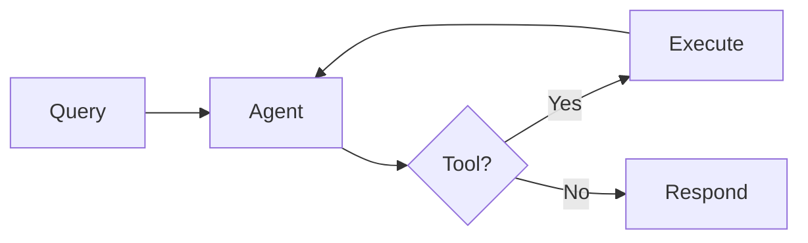

# Visual Assets

Icons, infographics, and visual design resources for the course.

## Course Icons

Custom icons for each course topic, using Material Design style.

<div class="icon-grid">

<div class="icon-card">
  <div class="icon-preview" style="width: 48px; height: 48px; color: #3333B2;">
    {{ icon[1].svg }}
  </div>
  <span class="icon-name">{{ icon[1].name }}</span>
  <code class="icon-id">{{ icon[0] }}</code>
</div>

</div>

### Using Icons

In pages and layouts:

```liquid
{{ site.data.icons.topics.agent.svg }}
```

With custom styling:

```html
<span class="topic-icon" style="color: #3333B2;">
  {{ site.data.icons.topics.reasoning.svg }}
</span>
```

### Action Icons

<div class="icon-grid">

<div class="icon-card">
  <div class="icon-preview" style="width: 32px; height: 32px; color: #0066CC;">
    {{ icon[1].svg }}
  </div>
  <code class="icon-id">{{ icon[0] }}</code>
</div>

</div>

---

## Infographics

Guidelines for creating course infographics.

### Design Principles

1. **Single Concept**: One infographic = one key concept
2. **Consistent Style**: Use course color palette
3. **Minimal Text**: Let visuals do the work
4. **Scalable**: Works at multiple sizes

### Color Palette

| Color | Hex | Usage |
|:------|:----|:------|
| MLPURPLE | `#3333B2` | Primary, headings |
| MLBLUE | `#0066CC` | Links, secondary |
| MLORANGE | `#FF7F0E` | Accents, highlights |
| MLGREEN | `#2CA02C` | Success, positive |
| MLRED | `#D62728` | Errors, warnings |

### Creating Infographics

Use Python with matplotlib for programmatic generation:

```python
import matplotlib.pyplot as plt
from pathlib import Path

# Course colors
MLPURPLE = '#3333B2'
MLBLUE = '#0066CC'
MLORANGE = '#FF7F0E'

plt.rcParams.update({
    'font.size': 12,
    'font.family': 'sans-serif',
    'figure.figsize': (10, 6),
    'figure.dpi': 150
})

fig, ax = plt.subplots()
# Your visualization code here
plt.tight_layout()
plt.savefig(Path(__file__).parent / 'infographic.pdf',
            dpi=300, bbox_inches='tight')
```

### Infographic Types

| Type | Best For | Example |
|:-----|:---------|:--------|
| **Flow Diagram** | Processes, pipelines | ReAct loop |
| **Comparison** | Side-by-side analysis | Framework comparison |
| **Hierarchy** | Structures, taxonomies | Agent types |
| **Timeline** | Historical progression | LLM development |
| **Venn Diagram** | Overlapping concepts | RAG vs agents |

### Week-by-Week Infographic Ideas

| Week | Concept | Suggested Visual |
|:-----|:--------|:-----------------|
| 1 | ReAct Loop | Circular flow: Thought -> Action -> Observation |
| 2 | Prompting Strategies | Decision tree: Zero-shot -> Few-shot -> CoT |
| 3 | Tool Integration | Hub and spoke: LLM -> Tools |
| 4 | Planning Architectures | Comparison grid: Plan types |
| 5 | Multi-Agent Patterns | Network diagrams: Orchestration patterns |
| 7 | RAG Pipeline | Flow: Query -> Retrieve -> Generate |
| 8 | Knowledge Graph | Node-edge diagram |
| 9 | Verification Chain | Multi-step process flow |

### File Organization

```
week-folder/
  infographics/
    01_concept_name/
      infographic.py
      infographic.pdf
```

---

## Diagram Tools

### Mermaid (Built-in)

Just the Docs supports Mermaid diagrams:



### Graphviz

For complex diagrams, use Graphviz in Python:

```python
from graphviz import Digraph

dot = Digraph()
dot.node('A', 'Agent')
dot.node('B', 'Environment')
dot.edge('A', 'B', 'action')
dot.edge('B', 'A', 'observation')
dot.render('diagram', format='pdf')
```

---

<style>
.icon-grid {
  display: grid;
  grid-template-columns: repeat(auto-fill, minmax(120px, 1fr));
  gap: 1rem;
  margin: 1.5rem 0;
}

.icon-card {
  background: var(--bg-secondary, #f8f9fa);
  border-radius: 8px;
  padding: 1rem;
  text-align: center;
  border: 1px solid var(--border-color, #ddd);
}

.icon-preview {
  margin: 0 auto 0.5rem;
}

.icon-preview svg {
  width: 100%;
  height: 100%;
}

.icon-name {
  display: block;
  font-size: 0.85rem;
  margin-bottom: 0.25rem;
}

.icon-id {
  font-size: 0.75rem;
  color: var(--text-muted, #999);
}
</style>
